# Autentificación con Passport.js - Platzi
## Stacks de seguridad

### Intranet
Antiguamente las empresas se comunicaban mediante una intranet que a diferencia del internet esta es una red privada que funciona dentro de las compañias en esta red habian protocolas como **SOAP** **SAML** y **WS FEDERATION**, pero estos protocolos se quedaron muy cortos con la revolución mobile, ademas tecnologías como HTML5 empezaron a necesitar otra serie de cosas y conceptos como la __autentificación__ y la __autorización__ tambien necesitaban una evolución, ademas el auge de los __microservicios__ y la necesidad de tener mutiples clientes hicierón necesario la creación de un nuevo stack

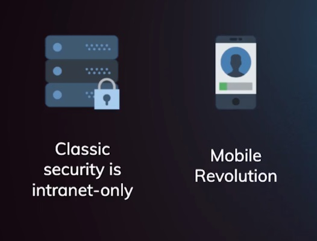

### Stack de seguridad moderna
Este stack se compone generalmente de 3 protocolos

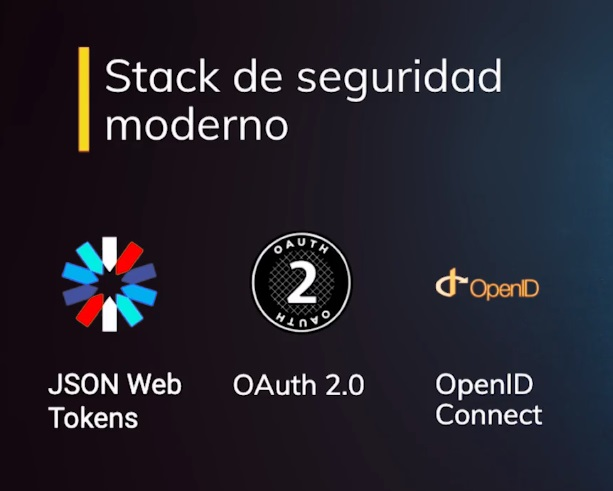

#### Json Web Token
Es un standard de código abierto que nos permite comunicarnos entre 2 clientes de una manera mucho más segura 
#### Open Authorization 2.0
Es un standard de la industria que nos permite implementar autorización(tener en cuenta las diferencias con autentificación)
Llego a una versión 2 por la necesidad de adaptarse a las nuevas tecnologias mobile
#### OpenID Connect
Es una capa de autentificación que funciona por encima de OAuth 2.0
## Autenticación

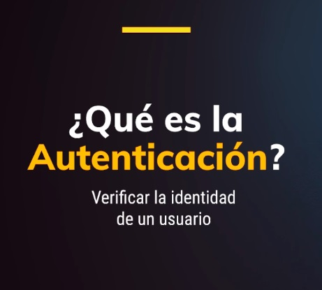

Acción de verificar la identidad de un usuario, verificar si el usuario existe y que sea el.
Algunas casas tienen un visor o camaras pero con la misma intencion, saber la identidad del que toca nuestras puertas de esa manera podemos decidir si lo dejamos entrar o no.

**¿Por qué hacemos esto?**
Porque en nuestras casas tenemos cosas personales y nosotros no queremos que todo el mundo vea nuestas cosas personales y en los sistemas pasa algo similiar, pero en vez de usar camaras usas el __usuario__ y __contraseña__ aunque algunos sistemas usan autentificación passwordless como huellas digitales u otros sistemas que no implica introducir la contraseña.

En nuestra aplicación vamos a implementar autenticación para posteriormente generar un Token de autorizacón

## Autorización

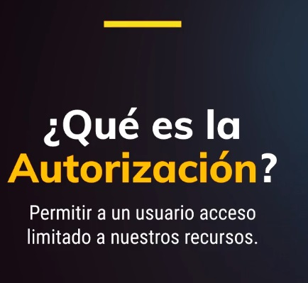

Los carros modernos suelen tener 2 llaves una llave que sibe para conducir y otra para el valet parking, este es un servicio que tienen algunos restaurantes o centros comericales donde un personal lo aparka por ti, esta llave tiene permisos muy limitados como solo para arrancar el carro mas no para abrir el baúl

En los sistemas pasas algo muy similiar, donde nostros otorgamos permisos de solo lectura y escritura en nuestra aplicación nostros vamos a otorgar una serie de permisos que van al usuario final de solo lectura y escritura sobre ciertas colecciones pero tambien vamos a otorgar ciertos permisos administrativos y rsto lo vamos a hacer manejando unos tokens que vamos a otorgarle a nuestro servidor.

## Sesiones

Cuando visitamos un sitio web se crea una petición HTTP, un protocolo que no tiene estado eso quiere decir que muchas peticiones HTTP nunca comparten información entre si, asi que la manera de compartir información de peticiones HTTP es mediante una sesión.

Cuando visitas un sitio por primera vez se crea una sesión no es necesario que estes autentificado para que esta sesión sea creada.

Supongamos que vas a un sitio a buscar vuelos, cuando tu entras al sitio se te crea una sesión y a medidas que vas haciendo busquedas de vuelo se van guardando tus preferencias de busqueda en esta sesión luega esta sesión genera un ID que es guardada en una cookie, la cookie es un archivo que se almacena en tu navegador para que cuando cierres el navegador la cookie permanezca con el ID de la sesión asi al proxima vez que vuelvas ese ID de la sesión que permanece en la cookie se relaciona con la sesión que estaba previamente abierta y asi puede cargar tus preferencias en los vuelos que estabas buscando, es por eso que muchas veces cuando nostros no iniciamos sesión podemos ver que nuestras preferencias estan ahi.

 Cuando hay un proceso de autenticación la sesión se almacena y se relaciona directamente con tu usuario por seguridad la sesión deberia terminar ciertos minutos despues de que halla inactividad, sinembargo dependiendo el mecanismo que estes usando prodias tener sesiones abiertas por dias incluso por meses

 __Cookies session__ y __Express Session__  Son librerias que nos permite implementar todo el tema de sesiones en express la diferencias mpas grande es que cookies session nos permite guardar la session en la cookie y express session nos permite guardar sesión en memoria en el lado del servidor, a la hora de escalar la sesion es muy importante usar base de datos en memoria como redis, eso es una ventaja que tiene JWT ya que no tiene estado y no necesita memoria 

 ## Resumen modulo 1
 
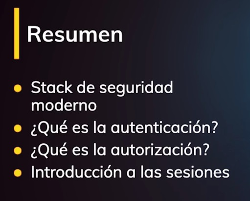

## Json Web Token
Es un estandar de la industria que nos permite generar demanda entre 2 clientes, y se ve así.

### JWT Decodificado
Un JWT consta de 3 partes generalmente divididas por un punto
#### Header
* El tipo, que por lo general es JWT 
* El algoritmo de encriptación de la firma
  * Puede ser Asincrono o Sincrono
  * Los algoritmo asincronos usan 2 llaves de encriptación, una pública paraencriptar y una privada para desencriptar
  * El algoritmo sincrono usa una sola llave para encriptar y para desencriptar
  * Ambos son seguros de usar pero depende donde los uses
  * Los algoritmos asincronos se usan cuando partes publicas tienen acceso a estas llaves
  * Los algoritmos sincronos solo deben usarse en sistemas como en el backend
#### Payload
Es donde guardamos todala información de nuestro usuario incluso todos los scopes de autorización, este payload se componen  de __Claims__ generalmente representado por 3 letras para mantener el JWT lo más pequeño, existen diferentes tipos de claims.

[claims list](https://tools.ietf.org/html/rfc7519)

#### Signature
La tercera parte del JWT es la firma y es la que hace muy poderosa el JWT esta compuesto del:
* Header codificado
* Payload codificado
A todo esto se le aplica el algoritmo de encriptación usando un secret, en el caso del algoritmo __HMACSHA256__ debemos usar un string de 256 caracteres de longitud.
## Autenticación tradicional vs JWT

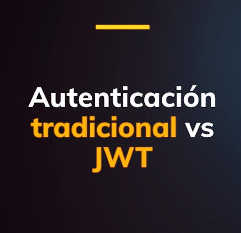

### Autenticación tradicional

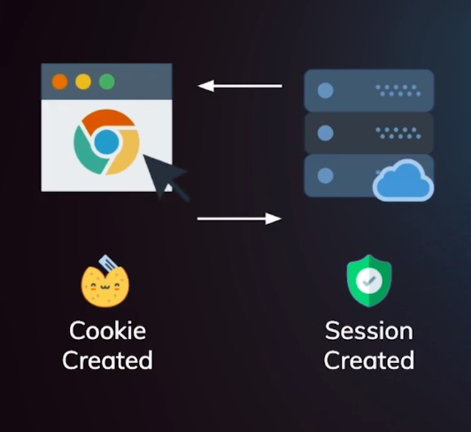

En la autenticación tradicional cuando sucede un proceso de autentificación se crea un sesión, el id de esta sesion se almacena en una cookie que es enviada al navegador.

Recordemos que las cookies no se llaman cookies por las galletas de chocolate si no por las gallertas de la fortuna que tienen mensajes adentro.

De ahi en adelante todos los request tienen la cookie que tiene almacenada el id de la sesión y esta es usada para verificar la sesión previamente activa.

Uno de los probelmas que tiene esta método es que clientes como la SPA no recargan la página entonces no se puede saber si hubo cambios en la sesión, otro problema es que por definición la REST API no tienen estado y al usar sesiones estamos creando esetado y esto contradice este principio.

Otro problema es que en arquitecturas modernas que usan microservicios la sesión que solo existe en una maquina no fluye durante los otros clientes, entonces es un poco dificil de escalar.

Y otro problema es que el control de acceso siemrpe requirer que vallamos a base de datos.

Finalmente controlar el uso de memoria puede ser otro problema ya que cada cliente que se conecta genera  otra sesión generando más consumo de memoria.

### Autenticación con JWT

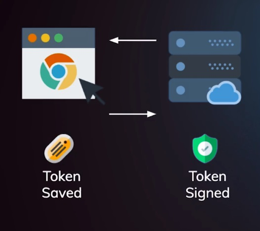

Al suceder el proceso de autenticación se firma un token a partir de ahi el token es enviado al cliente y este es almacenado en memoria o en una cookie, todos los request de ahi en adelante llevan este token una de las grandes ventajas es que una SPA ya no requiere del backend para saber si el usuario esta autenticado, lo otro es que el backend puede recibir multiples request de multiples clientes y lo único que le interesa es saber si el token esta bien firmado.

Finalmente es el cliente quien sabe que permisos tiene y no tiene que ir hasta base de datos para saber que permisos tiene.

## Firmando nuestro JWT

Para firmar un JWT tenemos que hacer uso de una libreria llamada JWT, esta tiene un método llamado __sign__.

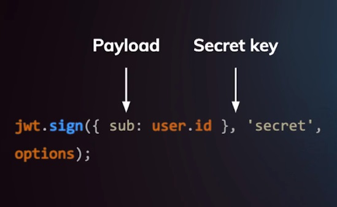

Este método recibe como argumento:
* Payload - Este esta construido con los  diferentes claims que definamos
* Secret - Con el cual sera firmado la firma del JWT
* options - opciones extra para el firmado del JWT

## Verificando nuestro JWT

Para la verificaciónd e nuestro jWT usando la misma libreria vamos a hacer uso del método __verify__.

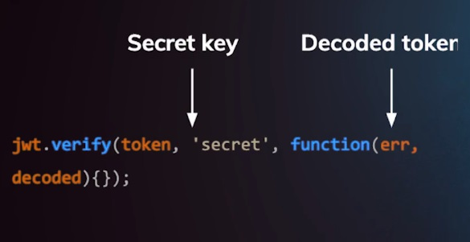

* token - recibimos el token que queremos verificar
* secret - recibimos el secret
* decoded token - recibimos un callback que nos va a devolver el jwt decodificado
  * tambien podemos omitirlo y recibirlo de forma asincrona

## Cookies

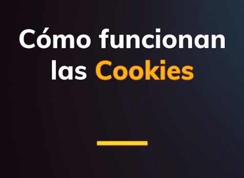

Pero primero que todo, ¿Qué es una cookie?

Una cookie es un archivo creado por un sitio web que tiene pequeños pedasos de datos almacenados en el, su proposito principal es identificar al usuario mediante el almacenamiento de su historial.

Las session cookie tienen un corto tiempo de vida ya que estan son removidas cuando se cierra la pestaña o el navegador.

Las persistent cookies se usan principalmente para rastrear al usuario guardando información de su interes.

Las secure cookies almacenan datos de manera cifrada para que terceros malintencionados no puedan rovar la información en el, suelen usarse en conexiones seguras (HTTPS).

### Leyes sobre las cookies
* Siempre deber avisar al usuario que estas haciendo uso de cookies en el sitio web
* Es necesario el concentimiento del usuario para que puedas implementar el manejo de cookies en tu sitio web
* Si las cookies son necesarias para la autenticación del usuario o para algún problema de seguridad, estas leyes no aplican en estos casos.

## Cookies vs Session Storage vs Local Storage

### Local Storage
* Almacenamiento maximo de 5MB.
* La información no se va con cada request que hacemos al servidor ayudando a reducir la información entre cliente y servidor.
* La información que se guarda en el local storage persiste aunque cerremos la ventana del navegador.
### Session Storage
* Muy similar al localstorage
* La información esta disponible solo por tab
* Apenas cerramos un tab la información deja de persistir
* La información que almacenamos en cada tab solo esta disponible en ese mismo tab.
* Cuando la información es medianamente sensible como nombres de usuarios.
### Cookies
* Almacenamiento de 4kb
* Se le puede asignar un tiempo de expiración.
* Por cada petición que se haga al servidor las cookies van pegadas a la petición ocacionando un consumo de datos cada que se hace una petición.
* Las cookies pueden ser seguras mediante un flag llamado HTTPonly.
* Información sensible como contraseñas o JWT
### Local Storage y Session Storage
* Solo información no sensible.
* Se le puede asignar un tiempo de expiración programaticamente con javascript.
## Resumen

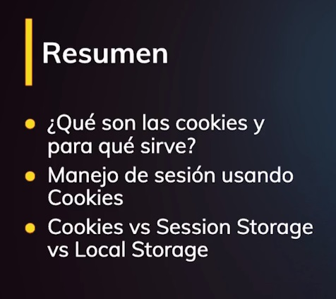

## Implementando passport.js

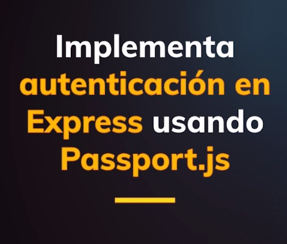

### Arquitectura del proyecto Platzi Video

La arquitectura depende de un API server.

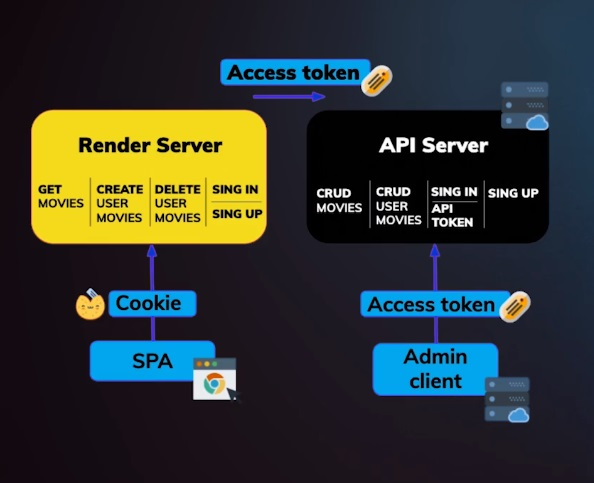

Este API tiene un CRUD de peliculas y agregaremos 2 endpoints más sigin(auntenticar un usuario) y signup(crear un usaurio) .

Para poder consumir el endpoint de signin los clientes, en este caso el admin client y el render server necesitan un __API token__ el cúal es muy diferente a un access token, este API token nis permite definir los permisos que tiene cada clietne.

* Admin client - permisos administrativos (CRUD)
* Render server - permisos públicos de solo lectura

Cuando cualquiera de estos cliente haciendo uso de estos diferentes APIs token hagan auntenticación, toda nuestra estrategia de autenticación va a generar un access token, el cual sera un JWT que va a tener la información del usuario que hace autenticación y los permisos determinados por el API token de esta manera en las peticiones siguientes nuestro render server o admin client con el access token que fue generado va a poder consumir los recursos del API token.

La SPA se va a comunicar con nuestra API a tra vez del render server que va a hacer de proxy, es muy importante que tenga un servidor, La manea como la SPA se va comunicar con el API server es a tra vez de una cookie que va a tener el access token del render server.

## Passport.js

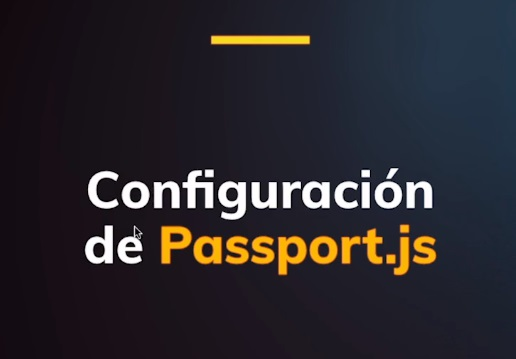

Passport.js es un middleware para express que nos permite implementar diferentes estrategias de autenticación de una manera muy facil y simple.

#### Dependencias necesarias:
* passport
* jsonwebtoken
* passport-http | para implementar la estrategia baisc de passport
* passport-jwt | para implementar la estrategia de jwt

## OAuth 2.0 y OpendID Connect
Son estandares que nos permiten implementar cosas como autorización mediante redes sociales.

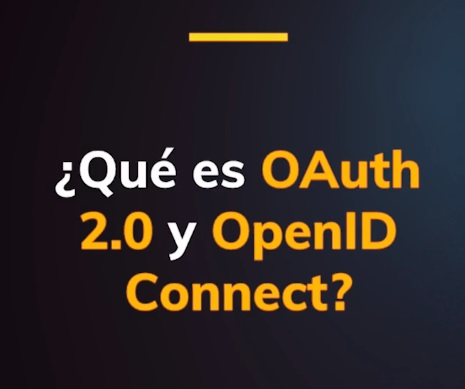

### OAuth 2.0

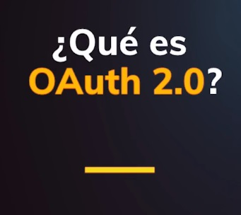

Es un estandard de la industria que nos permite implementar autorización.

Lo más importante para implementar OAuth 2.0 es entender cuales son los roles envueltos en los flujos.

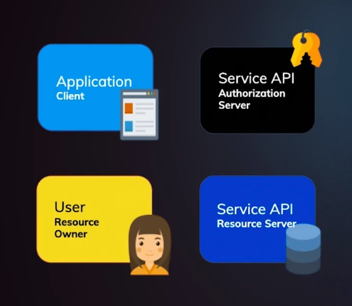

* 1er rol | User - Resource Owner
* 2do rol | Service API - Resource Server
* 3er rol | Application- client
* 3to rol | Service API - Authorization server

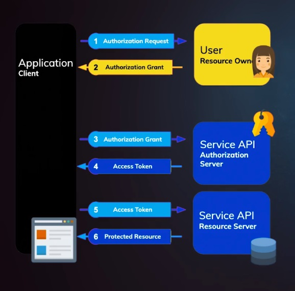

El flujo empieza cuando la app quiere hacer un authorization request entonces tú como usuario debes permitirle a la app acceder a tus recursos, eso lo hace mediante un __authorization grant__ con la cual la app va al __authorization server__ verifica que los datos son correctos y te da un acces token, el cual podria ser un token cualquiera o un JWT.

A partir de ahi la app con ese access token puede hacer cualquier petición y obtener recursos en tu nombre entonces el __resource server__ que seria el API devolveria los recursos protegidos gracias a que tu le enviaste un access token.

Un ejemplo del mundo real para que sea muchos más entendible.

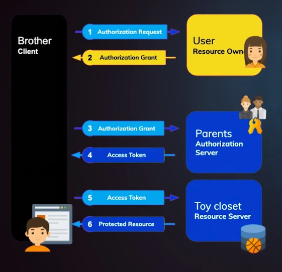

Supongamos que el cliente es tu hermano, él cual quiere acceder a la pelota que esta en el closet(resource server) pero tú no te encuentras en casa sin embargo tus padres sí, entonces el hermano intentaria pedirte una autorización, tú lo que podrias enviar como authorization grant es una carta iciendo que tu hermano esta permitido en obtener la pelota, tu hermano con esa carta se drigie a sus padres(authorization server) los cuales verificarian que sea una carta con tu letra y le darias las llaves(access token) ahora tu hermano puede acceder al closet y obtener la pelota y así es como funcionaria OAuth

### OpenID Connect

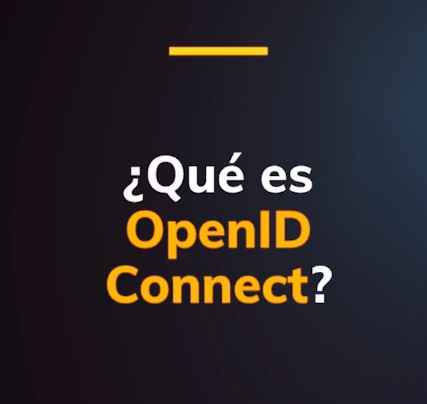

Es una capa de autenticación que funciona sobre OAuth 

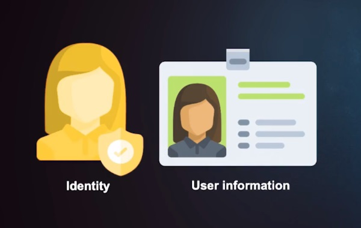

Las compañias que empezaban a usar OAuth para autenticar estaban teniendo problemas de seguridad, facebook tuvo problemas ya que se estaban suplantando access token para hacer todo el proceso de autenticación, entonces facebook tuvo que hacer unas soluciones sobre esa capa de OAuth y lo que paso es que las otras empresas empezaron a implementar esos fixes.

OpenID Connect se trata de crear un estandard así todas las personas no tienen que hacer su propia versión de autenticación sobre OAuth, las diferencias que tienen es que los access token se usan exclusivamente para los llamados al API, es decir para obtener los recursos y entra un concepto llamado ID Token, es un nuevo token que nos permite saber si el usuario esta autenticado y nos permite tambien obtener la información del usuario

Basicamente OpenID implementa unos claims y unos scopes definidos para este ID Token y debemos implementear tambien un endpoint llamados user-info donde enviamos el ID Token y podamos obtener toda la información del usuario.

OpenID Connect tambien define como debemos hacer uso del manejo de session como logout, signout, etc.

El flujo es masomenos el siguiente, se hace un request a /auth y este nos devuelve el ID Token el cual debe tener definido los scopes de OpenID y Profile con este ID Token sabemos que el usuario esta autenticado y ya finalmente podemos hacer un request a /user-info para obtener toda la información del usuario 